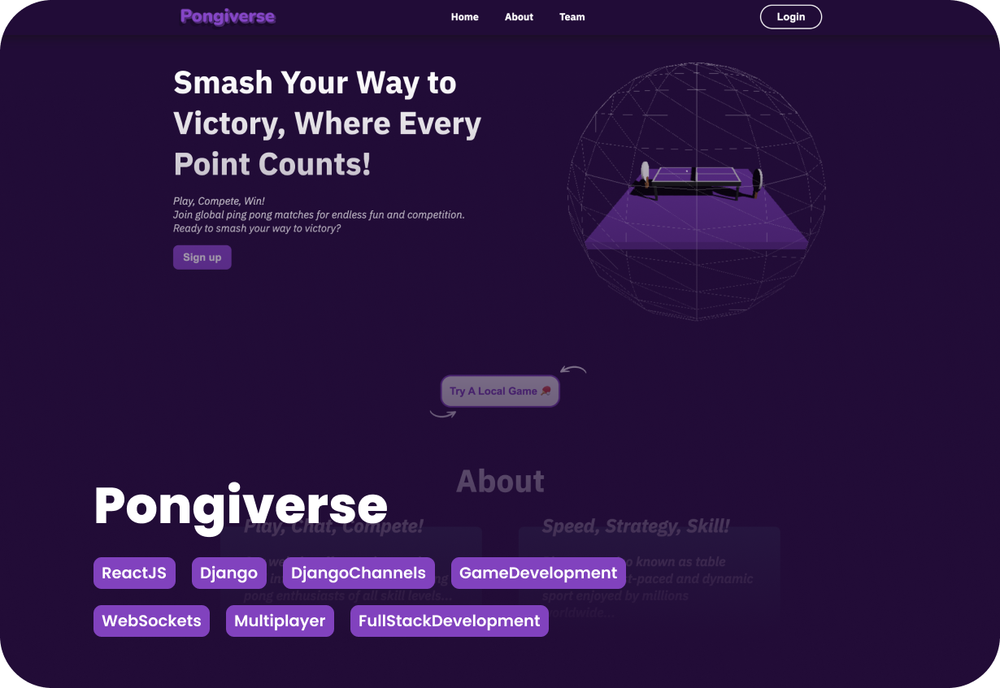

<div align="center">
<h1 style="text-align: center; background-color: #220C37; color: white; padding: 10px;">
  Pongiverse • Ping Pong Game Website
</h1>

</div>

<div align="end">


</div>

## Overview 🏓
*This is a real-time multiplayer **Ping Pong Game** built with:*
- **Frontend**: React (Vite) + WebSockets
- **Backend**: Django (Django Channels) + WebSockets
- **Database**: PostgreSQL
- **Authentication**: OAuth (Google, Intra42)
- **Deployment**: Docker + Nginx
- **Caching & WebSocket Pub/Sub**: Redis
- **Monitoring**: Prometheus & AlertManager

## Features 🚀
- 🎮 Real-time multiplayer Ping Pong game using WebSockets
- 🔒 OAuth authentication (Google & Intra sign-in)
- 🚀 Deployed with Docker and Nginx
- 📊 System monitoring with Prometheus & AlertManager
- 🗃️ PostgreSQL database for storing user data
- 🔁 Redis for caching & WebSocket handling

## Tech Stack 🛠️
| Tech | Purpose |
|------|---------|
| **React (Vite)** | Frontend UI |
| **Django & Django Channels** | Backend & WebSockets |
| **PostgreSQL** | Database |
| **Redis** | WebSocket Pub/Sub & Caching |
| **Nginx** | Reverse proxy for frontend & backend |
| **Docker** | Containerization |
| **Prometheus & AlertManager** | System Monitoring |

## Setup & Installation ⚙️
### 1️⃣ Clone the Repository
```sh
git clone https://github.com/elmehdi-kenane/pongiverse
cd pongiverse
```

### 2️⃣ Configure Environment Variables
Rename `.env.example` to `.env`
```sh
cp .env.example .env
```
> [!NOTE]  
> Update **all occurrences** of `YOUR_DOMAIN_NAME` with your actual domain and other variables accordingly in the `.env` file.


### 3️⃣ Run Docker Containers 🐳
Ensure you have **Docker & Docker Compose** installed, then run:
```sh
make
```
This will start the frontend, backend, database, and Redis containers.

### 5️⃣ Access the Application 🌍
- 🌐 **Frontend**: `https://yourdomain.com`
- 🛠 **Backend API**: `https://yourdomain.com/api`

## Monitoring System 📈
- **Grafana**: `http://localhost:3030`

## Contributing 🤝
Feel free to submit pull requests or report issues on [GitHub](https://github.com/elmehdi-kenane/pongiverse/issues).

## Contributors 🙌

This project is a team effort. Thanks to all the contributors for their hard work! ✨

- **[Contributor 1 Name](https://github.com/contributor1)**
- **[Contributor 2 Name](https://github.com/contributor2)**
- **[Contributor 3 Name](https://github.com/contributor3)**
